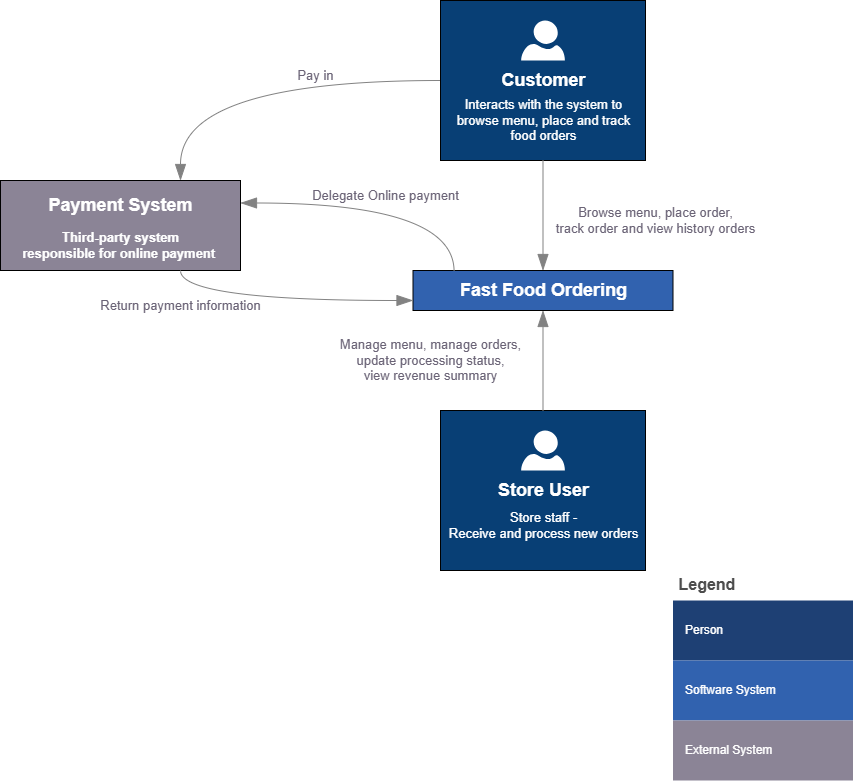
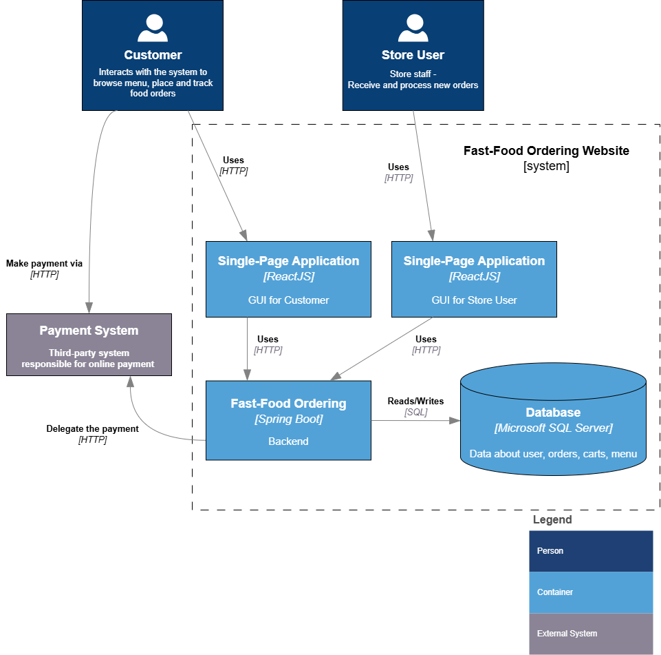

# 🍔 FoodFast Ordering Website

This is an **online food ordering web application** that allows users to browse menus, add items to the cart, and track their order status in real time.  
The interface is designed to be friendly, responsive, and optimized for both desktop and mobile users.

---

> ⚙️ This repository contains the **full FoodFast Ordering System**, integrating both **frontend** and **backend** modules.  
> 
> - The **frontend (UI)** is built with **ReactJS** and is sourced from the [FoodFast Frontend Repository](https://github.com/BaoTran019/foodfast-delivery-web).  
> - The **backend** is built with **Spring Boot** and is sourced from the [FoodFast Backend Repository]().  
> 
> 🔗 The system combines these modules to provide a complete ordering platform, including database and services.

---

## Main Features

- **Menu Browsing / Menu Management**  
  Customers can browse the food menu while administrators can create, update, and manage menu items.

- **Cart Management**  
  Customers can add products to their cart, update item quantities, and maintain their cart across sessions or devices.

- **Order Processing & Tracking**  
  Customers can place orders and track the real-time status of each order.

- **Order Management**  
  Administrators can view incoming orders and update their statuses through the system.

- **Authentication**  
  User login, registration, and session management to secure and personalize the ordering experience.

---

## 🛠️ Technology Stack

- **Frontend:** Built with **ReactJS**, providing a responsive and interactive user interface for the FoodFast Ordering System.  
- **Backend:** Built with **Spring Boot**, handling all business logic.  
- **Integration:** The frontend and backend are combined in this repository to form the full FoodFast Ordering System.

---

## 🔭 High-Level Overview



## 🧱 Application Architecture


---

## 👥 Contributors
| No. | Member | Responsibilities |
|:--:|:------------|:--------|
| 1 | Trần Gia Bảo | Frontend, UI design, Docker deployment|
| 2 | Trương Quang Long | Analyst and Design system, Frontend, writing document |
| 3 | Huỳnh Trọng Phúc | Testing, Backend, writing document  |
| 4 | Nguyễn Minh Nhựt | Analyst and Design system, Backend, writing document |

---

## 💡 Inspiration & Assets

This project is **inspired by the Popeyes website**.  
Some menu items are adapted from Popeyes’ offerings for demonstration purposes.  

All icons used in this repository are **sourced from [Flaticon](https://www.flaticon.com/)**.

---

## ⚙️ How to run
Before starting the application, you must execute the following two SQL files in SQL Server to initialize the sample database:

1. **schema.sql** – Creates the database schema (tables, constraints, etc.)
2. **database.sql** – Inserts sample data into the tables

### Using Command Prompt (CMD)

## back-end
```bash
cd backend
mvn clean package -DskipTests       #to build jar
java -jar target/demo-0.0.1-SNAPSHOT.jar
```

The back-end will run as **Localhost:8080**

## front-end (Website & Monitor)

```bash
cd web      # or cd monitor
npm install
npm run dev
```

The UI will run as **Localhost:5173** and **Localhost:5174**, depending on which one starts first.

### 🐳 Using Docker Compose
Make sure you have **Docker** and **Docker Compose** installed.

Then run:
```bash
docker compose up -d 
```


